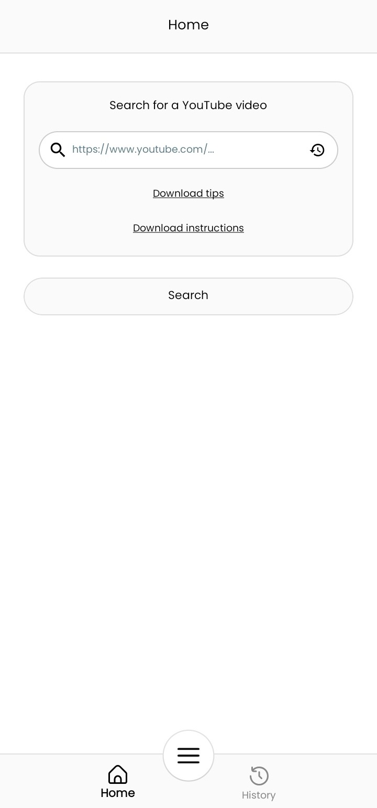
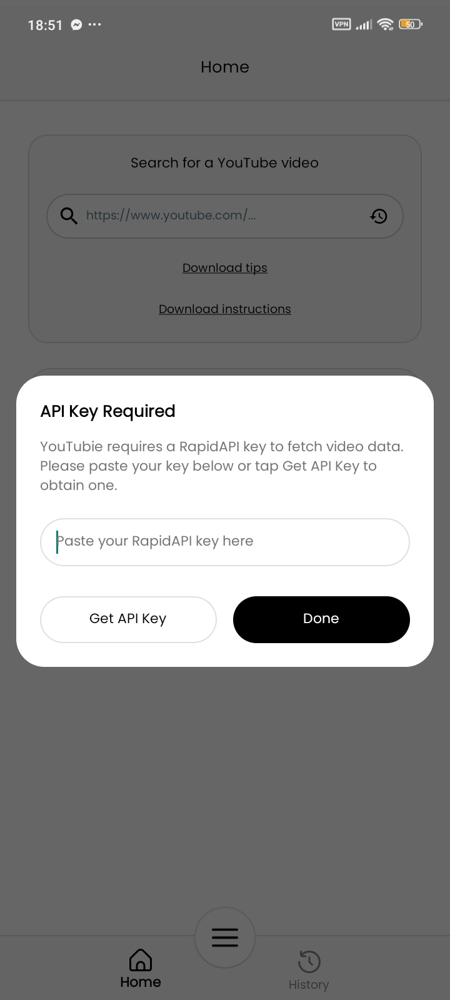
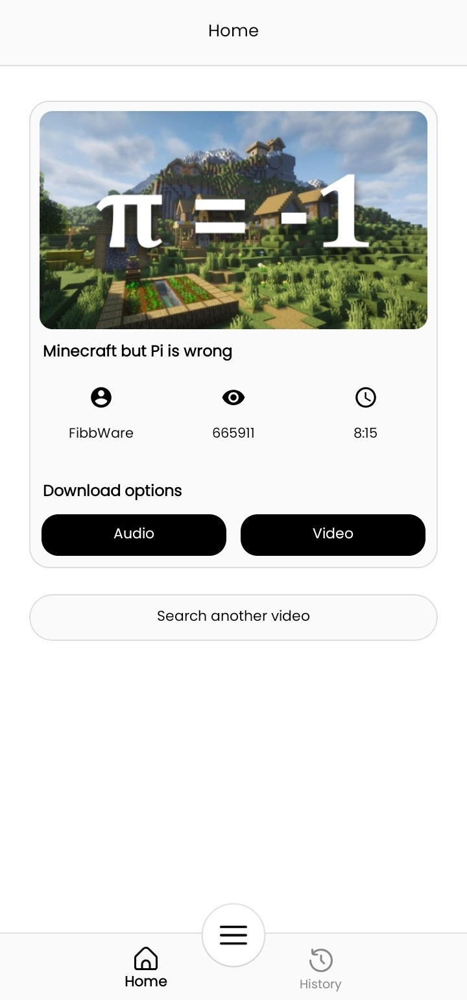
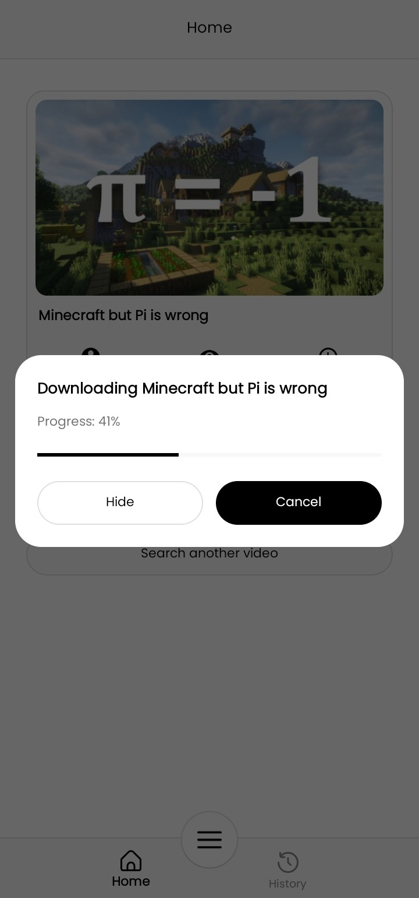
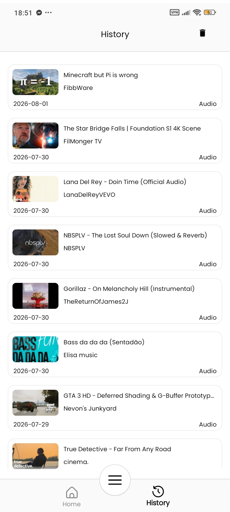

# YouTubie Android App


**YouTubie** is a high-performance video discovery and download prototype for Android. Built with a modern tech stack and a focus on speed, it demonstrates a modular architecture capable of handling multi-threaded data transfers and delivering a consistent, immersive user experience.

---

## 🚀 Key Pillars

### 1. High-Performance Speed
*   **Multi-threaded Engine**: Utilizes a custom 4-thread parallel download system with automatic chunk merging.
*   **Range-Based Fetching**: Implements HTTP Range headers to maximize bandwidth usage during audio and video downloads.
*   **Optimized Throughput**: Features a large 256KB data buffer for smooth, high-speed transfers on modern networks.


### 2. Robust Architecture
*   **Dagger Hilt DI**: Clean dependency injection for testability and scalability.
*   **WorkManager Integration**: Reliable background task handling for long-running parallel transfers.
*   **Coroutines & Flow**: Reactive UI state management for a flicker-free, responsive interface.

### 3. Seamless User Experience
*   **Clipboard Auto-Detection**: Automatically detects copied YouTube links on launch/focus with 1-tap paste and search.
*   **Direct Share Target**: Integrates into the Android system Share Sheet to auto-search links shared directly from YouTube.
*   **Recent Searches Modal**: Quick-access search history sheet with 1-tap replay and clearing.
*   **In-App Preferences**: Manage your RapidAPI key and toggle clipboard auto-paste preferences anytime.

---

## 📸 Screenshots

<p align="center">
  
  &nbsp;&nbsp;
  
  &nbsp;&nbsp;
  
</p>
<p align="center">
  
  &nbsp;&nbsp;
  
</p>

| Screen | Description |
| :---: | :--- |
| **Home** | Paste a YouTube URL or search to discover videos |
| **API Key Setup** | First-launch dialog to enter your RapidAPI key |
| **Search Results** | Video details with thumbnail, views, duration, and Audio/Video download options |
| **Download Progress** | Real-time progress bar powered by the parallel download engine |
| **Download History** | Browse all previously downloaded files with metadata |

---

## 🛠️ Technical Deep Dive

### Parallel Download Engine
The core of YouTubie's performance lies in its `DownloadWorker`. Instead of standard sequential streams, the app:
1.  **Analyzes**: Checks server support for `Accept-Ranges`.
2.  **Segments**: Splits the target file into 4 equal segments.
3.  **Executes**: Spawns concurrent Coroutines to fetch segments in parallel.
4.  **Synchronizes**: Uses `FileChannel` to write segments to specific file offsets simultaneously, ensuring zero data corruption and maximum speed.

### Tech Stack
| Layer | Implementation |
| :--- | :--- |
| **Networking** | Retrofit 3 + OkHttp 5 |
| **DI** | Dagger Hilt |
| **Image Loading** | Glide 5 (with optimized caching) |
| **Concurrency** | Kotlin Coroutines + StateFlow |
| **Persistence** | SharedPreferences + GSON |
| **Background Tasks** | WorkManager |

---

## 🚦 Quick Start

### Prerequisites
*   Android Studio Koala or newer.
*   Android SDK 37.
*   A valid [RapidAPI](https://rapidapi.com/) account with the [YT-API](https://rapidapi.com/ytjar/api/yt-api) enabled.

### 1. Configure API Keys
The app requires a `RAPID_API_KEY` to function. There are two ways to provide it:

**For developers (building from source):**
1. Create a `local.properties` file in your root directory.
2. Add your key:
```properties
RAPID_API_KEY=your_actual_rapidapi_key_here
```

**For APK users:**
On first launch, the app will prompt you to enter your RapidAPI key via a setup dialog. You can obtain a key from the [YT-API page on RapidAPI](https://rapidapi.com/ytjar/api/yt-api). You can change your API key and configure auto-paste settings at any time from the FAB menu → "Preferences".

### 2. Build and Run
Open the project in Android Studio, sync with Gradle, and deploy to a device with API level 23+.
```bash
./gradlew installDebug
```

---

## 🏗️ Architecture Layout
```text
youtubie/
├── app/
│   ├── src/main/java/com/youtubie/app/
│   │   ├── data/        # Repository, API Services, and Parallel Download Engine
│   │   ├── di/          # Hilt Dependency Injection Modules
│   │   ├── ui/          # ViewModels, Fragments, Activities, and API Key Dialog
│   │   └── util/        # Preference Management, Storage Utils, and UI Helpers
│   └── src/main/res/    # Material vector drawables, Layouts, and Immersive Animations
```

---

## ⚠️ Disclaimer
This is a portfolio project created for educational and demonstration purposes. Please respect all digital licenses, copyrights, and terms of service when using this application.

---

## 📄 License
MIT © YouTubie Contributors
